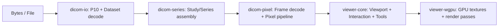

# Architecture

## Summary

Normative:
- **REQ-ARCH-101:** The implemented workspace layout and crate responsibilities **MUST** match this document. Divergences **MUST** update this spec and its verification text.

Verification:
- CI/PR review **MUST** compare `cargo metadata` workspace members against this document for boundary conformance.

The framework is structured as a Cargo workspace with a **portable core** (no OS APIs, WASM-compatible), service-layer crates for networking/storage/workflow, and **platform glue** layers for native and web rendering. A strict conformance/workflow envelope governs which DICOM objects, services, and operational behaviors are accepted.

## Workspace layout (proposed)

This repository uses a workspace layout that makes portability and security boundaries explicit (see **REQ-ARCH-101**).

Reference structure (informative; names may evolve, responsibilities must not):

```
crates/
  rdvf/             # public API facade, feature aggregation, stable re-exports
  dicom-core/        # tags, VRs, dataset model, element decoding primitives
  dicom-io/          # P10 reader, streaming, limits, filesystem helpers (native-only)
  dicom-net/         # UL PDU parsing, association negotiation, state machine
  dicom-dimse/       # DIMSE command parsing (echo/store/query/retrieve)
  dicom-dimse-service/ # DIMSE SCU/SCP service harness
  dicom-web/         # DICOMweb request parsing/routing (QIDO/WADO/STOW)
  dicom-storage/     # deterministic ingest + dedup + write-ahead log
  dicom-index/       # deterministic metadata indexing
  dicom-query/       # deterministic query/retrieve matching
  dicom-worklist/    # Modality Worklist validation/ordering
  dicom-mpps/        # MPPS validation/transition handling
  dicom-auth/        # authn/authz policy hooks
  dicom-audit/       # audit redaction and retention controls
  dicom-series/      # series/study assembly, geometry validation, ordering
  dicom-pixel/       # transfer syntax decode + pixel pipeline (CPU boundary deterministic)
  viewer-core/       # viewport model, interaction state machine, tools, scene graph
  viewer-wgpu/       # wgpu renderer implementation (native + web)
  viewer-wasm/       # wasm glue (bindings, browser IO adapters)
  modality-ct/       # optional pack (enhanced CT specifics)
  modality-pet/      # optional pack (SUV, fusion constraints)
  modality-mg/       # optional pack (mammography constraints)
  modality-xr/       # optional pack (XR/CR/DR constraints)
codex/
  rules/
docs/
.agents/
  skills/
```

### Normative requirements

- **REQ-ARCH-105:** The workspace **MUST** include a public API facade crate (`rdvf`) that re-exports portable core APIs and exposes feature capability queries.
- **REQ-ARCH-102:** `dicom-core`, `dicom-series`, `dicom-pixel`, and `viewer-core` **MUST** build for `wasm32-unknown-unknown`.
- **REQ-ARCH-103:** Any crate that uses `std::fs`, OS paths, or threading APIs **MUST** be isolated behind:
  - a platform-specific crate (`dicom-io`, `viewer-wasm`), and/or
  - explicit Cargo features with `cfg` gating.
- **REQ-ARCH-104:** Any non-Rust codec implementation (FFI) **MUST** live in a dedicated crate (e.g., `dicom-codec-j2k-sys`) and be optional by feature.

Verification:
- `cargo build -p rdvf` for the public API facade.
- `cargo build --target wasm32-unknown-unknown` for portable crates.
- Workspace lint (CI) to ensure OS-only dependencies are gated or isolated.
- Feature-gated codec crates documented in `Cargo.toml` and buildable only with explicit features.

## Dataflow



### Boundary invariants (normative)

- **REQ-ARCH-110:** `dicom-io` **MUST** enforce input limits before allocating large buffers (see `docs/09-Security-Threat-Model.md`).
- **REQ-ARCH-111:** `dicom-pixel` **MUST** provide a CPU-boundary output that is byte-for-byte deterministic for a given input and configuration.
- **REQ-ARCH-112:** `viewer-wgpu` **MUST NOT** directly parse DICOM; it consumes typed frame/scene structures only.

Verification:
- Unit tests **MUST** cover limit enforcement at the input boundary.
- Golden-corpus tests **MUST** compare deterministic CPU boundary output hashes.
- Static dependency audit **MUST** confirm `viewer-wgpu` does not depend on DICOM parsing crates.

## Configuration surfaces

The system exposes a single configuration struct (`rdvf::Config`) that controls:

- conformance tier and enabled packs,
- resource limits (bytes, pixels, frames, time),
- rendering options (sampling, interpolation modes),
- logging/telemetry.

Configuration is serializable (e.g., to JSON) for reproducibility in tests and bug reports.

Requirements:
- **REQ-ARCH-120:** The system **MUST** expose a single configuration surface that governs conformance tier, limits, rendering options, and telemetry.
- **REQ-ARCH-121:** Configuration **MUST** be serializable for reproducibility in tests and bug reports.
- **REQ-ARCH-122:** `rdvf::Config` **MUST** aggregate `Limits` and feature `Capabilities` as part of the public API facade.

Verification:
- Unit test **MUST** serialize/deserialize the config and assert semantic equality.
- Unit test **MUST** assert `rdvf::Config::default()` includes `Limits::default()` and the detected capability set.

## Concurrency model

- Native builds **MAY** use a bounded thread pool for:
  - series scanning,
  - pixel decode,
  - volume resampling.
- **REQ-ARCH-130:** WASM builds **MUST** function in a single-threaded mode by default.
- **REQ-ARCH-131:** If WASM threads are enabled (via `wasm32` + `SharedArrayBuffer`), concurrency **MUST** remain optional and gated.
- **REQ-ARCH-132:** If native builds enable background concurrency, the pool **MUST** be bounded and configurable.

Verification:
- WASM build configuration **MUST** compile and run in single-threaded mode.
- Native configuration tests **MUST** confirm bounded pool sizing and configuration wiring.

## Assumptions and verification

Assumption: `wgpu` supports required texture formats on all native platforms but may vary on web.

Justification: backend capability differences exist between Vulkan/Metal/DX12/WebGPU.

Verification method:
- **REQ-ARCH-140:** The renderer **MUST** query `wgpu` device limits and features at runtime.
- **REQ-ARCH-141:** Automated smoke tests **MUST** cover at least:
  - one native backend (CI), and
  - one wasm/web backend (CI or documented manual gate),
  using a shared golden corpus to validate output.

Verification:
- Runtime capability probe tests **MUST** assert the query path is executed.
- CI **MUST** run native smoke tests; WASM smoke tests **MUST** be run in CI or documented as a manual gate.
