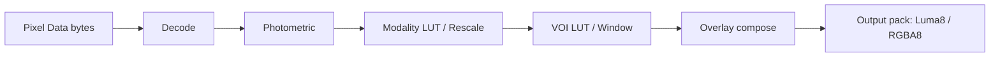

# Pixel pipeline

## Purpose

Normative: **REQ-PIX-200:** Implementations **MUST** apply the pipeline stages in the specified order and **MUST** treat deviations as conformance changes requiring updated tests.

This document defines the **normative** pixel processing pipeline used to convert DICOM Pixel Data into renderable textures. The pipeline is designed to be **deterministic**, **fail-closed**, and safe against malicious inputs.

Note: When the optional `raster-io` feature is enabled, the project also exposes a **non-DICOM** raster decode path (`decode_raster_bytes`) for BMP/PNG/JPEG/TIFF inputs. This path is outside the DICOM conformance envelope and produces CPU-boundary `DisplayFrame` outputs without modality/VOI semantics.

## Pipeline overview

Stages (normative order):

1. **Decode** (transfer syntax → raw samples)
2. **Photometric transform** (raw samples → canonical color model)
3. **Modality transform** (Modality LUT or Rescale Slope/Intercept)
4. **VOI transform** (VOI LUT or Window Center/Width)
5. **Overlays / annotations policy** (overlay plane composition; GSPS policy)
6. **Output packing** (canonical CPU output format for renderer)

Note: GSPS shutters and graphic annotations (when the optional `gsps` pack is enabled) are applied to the `DisplayFrame` **after** output packing and before user annotations. They do not alter the CPU pipeline stage ordering or the underlying pixel semantics.

### Normative requirements

- **REQ-PIX-202:** Each stage **MUST** be a pure function of:
  - input bytes,
  - extracted DICOM attributes,
  - pipeline configuration.
- **REQ-PIX-203:** The pipeline **MUST** be deterministic: for the same inputs/config it produces identical CPU-boundary output bytes and therefore identical output hashes (`SHA-256(DisplayFrame.bytes)`).
- **REQ-PIX-204:** The pipeline **MUST** validate declared sizes (rows/cols/frames/bits) against limits before allocation.
- **REQ-PIX-206:** The pipeline **MUST** reject unsupported photometric interpretations and unsupported bit-depth combinations per envelope.

Verification (for **REQ-PIX-200/202/203/204/206**):
- Unit tests **MUST** include a stage-order sentinel case where swapping any two stages changes expected output, and assert the golden output is produced only by the specified order.
- Determinism tests **MUST** run the pipeline repeatedly on identical inputs/config and compare output bytes (and hashes) for equality.
- Limit tests **MUST** assert that oversized declared dimensions fail with `LimitExceeded` before allocation.
- Envelope tests **MUST** assert that out-of-envelope photometric interpretations and bit-depth combinations fail with a typed error kind.

---

## Pixel pipeline source of truth and GPU constraints (normative)

RDVF treats the CPU pixel pipeline output (`Luma8`/`Rgba8`) as the **correctness oracle** and the GPU renderer as a presentation layer.

Requirements:

- **REQ-PIX-201:** All VOI and modality transforms (Rescale Slope/Intercept, Modality LUT, VOI LUT, Window Center/Width, MONOCHROME1 inversion) **MUST** be computed in the CPU reference pipeline defined in this document.
- **REQ-GPU-210:** GPU shaders **MUST NOT** implement or approximate VOI/modality transforms. GPU execution is restricted to:
  - sampling pre-quantized integer textures (`R8Unorm`/`RGBA8`),
  - compositing overlays in display space,
  - geometric transforms (pan/zoom/rotate/flip) and presentation.
- **REQ-PIX-205:** Any optional interpolation/resampling that changes pixels (beyond nearest-neighbor sampling of pre-quantized textures) **MUST** be feature-gated and **MUST** explicitly declare that output will not be byte-identical to the CPU oracle.

### CPU oracle profile lock (release baseline)

The CPU oracle baseline for this release is fixed as profile `cpu-oracle-baseline-v1`.

Profile invariants:
- VOI/modality precedence and equations are exactly those defined in Sections 3 and 4 of this document (`REQ-PIX-250`, `REQ-PIX-260`, `REQ-PIX-264`, `REQ-PIX-265`).
- Quantization semantics are exactly those in Section 6 (`REQ-PIX-291`, `REQ-PIX-292`).
- Determinism comparison uses only CPU-boundary bytes (`DisplayFrame.bytes`) and `SHA-256` hashing (`REQ-PIX-203`).
- Any change to these semantics is an envelope-level behavior change and requires release artifact updates per `docs/14-Release-and-Versioning.md`.

Verification:

- A renderer conformance test **MUST** render Tier 0 frames and read back selected tiles and compare them byte-for-byte against CPU pipeline output for those tiles.
- A shader lint step **MUST** ensure WGSL sources do not contain VOI/modality arithmetic (e.g., no window/level, rescale, LUT logic) in shader code.
- Renderer unit tests **MUST** reject non-quantized frame formats at the GPU entry boundary and **MUST** validate frame byte-length/format consistency before render submission.

Rationale (informative): WebGPU/WGSL permit indeterminate behavior for NaN/Infinity and allow backend-dependent floating-point details; the CPU oracle prevents GPU backend variance from affecting correctness claims. See `docs/15-Regulatory-and-Standards-Mapping.md`.

---

## 1) Decode stage

### Inputs

Requirements: **REQ-PIX-230:** Stage inputs **MUST** be derived from validated DICOM attributes within the conformance envelope, and missing/invalid attributes **MUST** be reported as typed errors.

- Transfer Syntax UID (from meta header)
- Pixel module fields (Rows/Columns, Bits Allocated/Stored, Pixel Representation, Samples per Pixel, Planar Configuration)
- Encapsulated or native Pixel Data element value

### Outputs

Requirements: **REQ-PIX-231:** Output buffers **MUST** have a byte length consistent with declared dimensions and format, and any mismatch **MUST** be treated as `DecodeError`.

A `RawFrame`:
- `width: u32`, `height: u32`
- `samples_per_pixel: u8`
- `sample_format`: one of:
  - `U8`, `U16` (Tier 0),
  - `I16` (Tier 0 if Pixel Representation indicates signed),
  - additional formats only if explicitly added by envelope packs.
- `pixels`: tightly packed, row-major, top-left origin, with no padding between rows.

### Requirements (normative)

- **REQ-PIX-232:** The decoder **MUST** support Tier 0 transfer syntaxes listed in `docs/03`.
- For uncompressed syntaxes:
- **REQ-PIX-233:** The decoder **MUST** interpret endianness per transfer syntax (Tier 0 assumes Little Endian).

### Video transfer syntax boundary

- MPEG/H.264/HEVC transfer syntaxes are recognized at IO boundary but decode availability is feature-gated.
- Default builds remain fail-closed for unsupported video decode paths.
- Pixel pipeline behavior for recognized-but-undecodable video transfer syntaxes is explicit error return; no silent fallback decode path is allowed.
  - **REQ-PIX-234:** `BitsAllocated` **MUST** be 8 or 16 in Tier 0.
- For RLE:
  - **REQ-PIX-235:** The decoder **MUST** validate segment table offsets and segment sizes before reading.
  - **REQ-PIX-236:** The decoder **MUST** reject RLE payloads that expand beyond configured decompressed limits.
- For JPEG Baseline:
  - **REQ-PIX-237:** The decoder **MUST** reject >8-bit samples.
  - **REQ-PIX-238:** The decoder **MUST** reject unexpected component counts that contradict Samples per Pixel.

Verification (for **REQ-PIX-230/231/232/233/234/235/236/237/238**):
- Unit tests **MUST** cover missing/invalid required attributes and assert typed error kinds.
- Decode tests **MUST** exercise RLE segment table bounds, decompressed-size limits, and JPEG Baseline >8-bit/component-count rejection paths.

### Optional codec packs (JPEG-LS / JPEG 2000)

When codec packs are enabled, decoder behavior **MUST** remain deterministic and bounded by limits.

Requirements:
- **REQ-CODEC-350:** Codec pack decoders **MUST** validate codec-derived dimensions and component counts against dataset metadata and **MUST** fail closed with `DecodeError` on mismatch.
- **REQ-CODEC-351:** Codec pack decoders **MUST** enforce `max_decompressed_bytes` before returning decoded samples.
- **REQ-CODEC-352:** Codec pack decoders **MUST** produce deterministic outputs for known-good samples when enabled.

Verification:
- Unit tests **MUST** cover codec metadata mismatch rejection, decompressed-size limits, and deterministic decode outputs for enabled codec packs.

---

## 2) Photometric transform stage

### Supported photometric interpretations (Tier 0)

Requirements: **REQ-PIX-240:** Photometric interpretations outside the declared profile support **MUST** be rejected.

- `MONOCHROME1`
- `MONOCHROME2`
- `RGB` (8-bit only in Tier 0)
- `YBR_FULL` is supported in the workstation profile for **native uncompressed/deflated Little Endian** and `RLE Lossless` transfer syntaxes.
- `YBR_FULL_422` is supported in the workstation profile for **native uncompressed/deflated Little Endian** transfer syntaxes only.
- `YBR_FULL_422` requires `Samples per Pixel = 3`, `Planar Configuration = 0`, and an even `Columns` value.

### Canonical internal color models

Requirements: **REQ-PIX-241:** Implementations **MUST** keep intermediate luminance/color values finite and clamp only at defined boundaries to preserve determinism.

- Grayscale path uses `GrayF64` (conceptual) in range `[0, 1]` after VOI, prior to quantization.
- Color path uses `RgbF64` in range `[0, 1]` after VOI (if applied) prior to quantization.

### Requirements (normative)

- For MONOCHROME2:
  - lower values map darker, higher values map brighter after VOI.
- For MONOCHROME1:
  - **REQ-PIX-242:** the pipeline **MUST** invert luminance relative to MONOCHROME2 as the final step of VOI mapping:
    - `L_out = 1.0 - L_out` (before quantization).
- For RGB:
  - **REQ-PIX-243:** The pipeline **MUST** validate Planar Configuration and reorder samples into interleaved RGB.
- For `YBR_FULL` / `YBR_FULL_422`:
  - **REQ-PIX-243:** The pipeline **MUST** validate profile constraints and convert YCbCr samples to RGB deterministically before output packing.

Verification (for **REQ-PIX-240/241/242/243**):
- Unit tests **MUST** cover photometric rejection, MONOCHROME1 inversion, RGB planar reordering, deterministic YBR conversion, and YBR fail-closed constraint checks.

---

## 3) Modality transform stage (Modality LUT / Rescale)

### Priority (normative)

Requirements: **REQ-PIX-250:** The stated precedence **MUST** be applied exactly; ties or partial data **MUST** not be resolved by undocumented heuristics.

If Modality LUT Sequence (0028,3000) is present and valid:
1. Apply Modality LUT Sequence.
Else:
2. If Rescale Slope (0028,1053) and Rescale Intercept (0028,1052) are present:
   apply rescale.
Else:
3. Identity transform.

### Rescale definition (normative)

Let stored sample be `s` interpreted as signed/unsigned according to Pixel Representation:

- `m = s * slope + intercept`

Where `slope` and `intercept` are parsed as DICOM DS (decimal string).

Requirements:
- **REQ-PIX-251:** Parsing DS **MUST** be strict and deterministic (no locale-dependent parsing).
  - Informative implementation note: DICOM value-padding bytes (space/NUL) are trimmed before strict numeric parsing so padded DS values remain in-envelope.
- **REQ-PIX-252:** Calculations **MUST** be performed in `f64` and the resulting modality value `m` carried as `f64` until VOI mapping.
- **REQ-PIX-253:** Non-finite results (NaN/Inf) **MUST** be treated as an error.

### Pixel padding policy (normative)

If Pixel Padding Value (0028,0120) is present:
- **REQ-PIX-254:** The pipeline **MUST** treat padding pixels as “excluded” for auto-window statistics.
- **REQ-PIX-255:** Padding pixels **MUST** still be rendered if VOI/window is explicitly specified (i.e., padding is not automatically transparent).

Verification (for **REQ-PIX-250/251/252/253/254/255**):
- Unit tests **MUST** assert precedence order, strict DS parsing determinism, and non-finite rescale error handling.
- Auto-window tests **MUST** validate pixel padding exclusion from statistics while explicit VOI renders padding pixels.

---

## 4) VOI transform stage (VOI LUT / Window)

## Numeric safety and non-finite handling (normative)

Requirements:

- **REQ-PIX-220:** The pipeline **MUST** reject (fail closed) any configuration or intermediate computation that produces a non-finite value (NaN/Infinity) at any stage (modality, VOI, overlay composition, output packing).
- **REQ-PIX-221:** The pipeline **MUST NOT** silently clamp or canonicalize non-finite values. It **MUST** return a typed error (`InvalidPixelTransform` or `DecodeError{stage="voi"}`) with non-PII context.
- **REQ-PIX-222:** All divisor terms used by window mapping **MUST** be guarded against zero and denormals by explicit preconditions:
  - window width is clamped to `>= 1.0` as already specified,
  - LUT sizes are validated against limits before indexing.

Verification:

- Unit tests **MUST** include cases for `WindowWidth <= 0`, extreme rescale values, and LUT edge cases and assert stable error kinds.
- Property tests **SHOULD** assert that for all in-envelope inputs, all intermediate values are finite.

Rationale (informative): WebAssembly and GPU backends can differ in NaN payload behavior; avoiding NaN/Infinity removes a known nondeterminism vector and strengthens reproducibility.

### Priority (normative)

Requirements: **REQ-PIX-260:** The stated precedence **MUST** be applied exactly; overrides **MUST** be explicit in configuration.

If VOI LUT Sequence (0028,3010) is present and valid:
1. Apply VOI LUT Sequence (unless configuration selects Window override).
Else if Window Center/Width are present:
2. Apply Window Center/Width using VOI LUT Function (0028,1056).
Else:
3. Apply **auto-window** heuristic (defined below).

### Window Center/Width parsing (normative)

- If multiple WC/WW values are present, index 0 is default.
- **REQ-PIX-261:** The framework **MUST** expose a stable selection mechanism (by index) via API/UI.

### VOI LUT Function (normative)

Requirements: **REQ-PIX-262:** Unsupported VOI LUT functions **MUST** fail closed unless a modality pack defines deterministic semantics and adds tests.

Supported values:
- `LINEAR` (default if missing)
- `LINEAR_EXACT`

Other values (e.g., `SIGMOID`) are out-of-envelope unless enabled by a modality pack.

### Window mapping equations (normative)

Let:
- `x` be modality value (f64).
- `c` be Window Center (f64).
- `w` be Window Width (f64).
- Output luminance `L` is in `[0.0, 1.0]`.

Preconditions:
- **REQ-PIX-263:** If `w < 1.0`, the pipeline **MUST** set `w = 1.0`.

#### LINEAR

Requirements: **REQ-PIX-264:** Implementations **MUST** implement this mapping exactly (including boundary conditions) for conformance when VOI LUT Function is LINEAR.

Define:

- `lower = c - 0.5 - (w - 1.0)/2.0`
- `upper = c - 0.5 + (w - 1.0)/2.0`

Then:

- if `x <= lower` → `L = 0.0`
- else if `x > upper` → `L = 1.0`
- else `L = ((x - (c - 0.5)) / (w - 1.0) + 0.5)`

#### LINEAR_EXACT

Requirements: **REQ-PIX-265:** Implementations **MUST** implement this mapping exactly (including boundary conditions) for conformance when VOI LUT Function is LINEAR_EXACT.

Define:

- `lower = c - w/2.0`
- `upper = c + w/2.0`

Then:

- if `x <= lower` → `L = 0.0`
- else if `x > upper` → `L = 1.0`
- else `L = ((x - c) / w + 0.5)`

After mapping, clamp:
- `L = clamp(L, 0.0, 1.0)`.

### Auto-window heuristic (normative)

Auto-window is used only when neither VOI LUT nor WC/WW is provided.

Algorithm (deterministic):
1. Compute modality values `m` for a deterministic sample set of pixels:
   - Sample stride `k = max(1, floor(sqrt(N / S)))` where:
     - `N = width * height`,
     - `S` is a configured sample target (default 65_536).
   - Iterate pixels in row-major order taking every `k`th pixel.
2. Exclude pixels equal to Pixel Padding Value if defined.
3. Sort sampled values.
4. Choose robust bounds:
   - `p_low = value_at_index(floor(0.005 * (M-1)))`
   - `p_high = value_at_index(ceil(0.995 * (M-1)))`
   where `M` is number of sampled values after exclusions (must be > 0).
5. Set:
   - `w = max(1.0, p_high - p_low)`
   - `c = (p_high + p_low) / 2.0`

Requirements:
- **REQ-PIX-266:** If `M == 0`, auto-window **MUST** fail with `MissingRenderablePixels`.
- **REQ-PIX-267:** The sampling and sorting **MUST** be deterministic (no randomized sampling).
- **REQ-PIX-268:** The chosen percentiles **MUST** be configurable but default to the above.

Verification (for **REQ-PIX-260/261/262/263/264/265/266/267/268**):
- Unit tests **MUST** cover WC/WW index selection, unsupported VOI LUT functions, LINEAR and LINEAR_EXACT boundary mappings, and auto-window determinism.
- Auto-window tests **MUST** assert `MissingRenderablePixels` when the sampled set is empty.

---

## 5) Overlay composition and GSPS policy

### Overlays (Tier 0)

Overlay Data (60xx,3000) is supported as a 1-bit plane if present.

Requirements:
- **REQ-PIX-280:** The pipeline **MUST** validate overlay dimensions and bit offsets.
- **REQ-PIX-281:** Overlay composition **MUST** occur after VOI (i.e., in display space), unless a modality pack defines an alternative.

Default overlay appearance:
- Grayscale: overlay pixels set luminance to `1.0` (white) unless configured.
- Color: overlay pixels set RGB to `(1.0, 0.0, 0.0)` only if color overlays are enabled; otherwise overlay is not applied.

### GSPS policy (default)

- GSPS application is **out-of-envelope** in core.
- If a GSPS feature is enabled:
  - **REQ-PIX-282:** the pipeline **MUST** apply GSPS transforms deterministically,
  - **REQ-PIX-283:** and **MUST** provide explicit precedence rules (GSPS vs WC/WW vs VOI LUT).

Verification (for **REQ-PIX-280/281/282/283**):
- Unit tests **MUST** cover overlay bounds validation and verify overlay composition order relative to VOI.
- If GSPS is enabled, integration tests **MUST** assert deterministic precedence against VOI/window inputs.

---

## 6) Output packing

### Canonical CPU output formats

**REQ-PIX-290:** The pixel pipeline **MUST** output one of:

- `Luma8`: 1 byte per pixel, 0..255, row-major.
- `Rgba8`: 4 bytes per pixel, RGBA, premultiplied alpha = 255, row-major.

Quantization (normative):
- **REQ-PIX-291:** `q = round(L * 255.0)` using:
  - `q = floor(L * 255.0 + 0.5)` for `L >= 0`,
  - saturate to `[0,255]`.

For MONOCHROME1 inversion:
- **REQ-PIX-292:** Apply inversion on `L` prior to quantization.

### Determinism across platforms

Determinism note (normative):

- The pixel pipeline **MUST** avoid NaN/Infinity generation (see **REQ-PIX-220**). When non-finite values are prevented, the remaining arithmetic and explicit rounding steps are required to be deterministic at the CPU boundary.

Verification method:
  - Golden corpus tests **MUST** compare output bytes across native targets.
  - Cross-target (native vs wasm) tests **SHOULD** compare hashes; if mismatches occur, the pipeline **MUST** switch to fixed-point window mapping for the affected path.

Verification (for **REQ-PIX-290/291/292**):
- Unit tests **MUST** validate quantization rounding and MONOCHROME1 inversion ordering.

---

## Verification requirements

- Unit tests **MUST** cover:
  - MONOCHROME1 inversion correctness,
  - WC/WW mapping for LINEAR and LINEAR_EXACT boundary cases,
  - auto-window determinism (stable output for identical inputs),
  - overlay composition bounds.
- Corpus tests **MUST** cover Tier 0 SOP classes and transfer syntaxes with expected output hashes.
