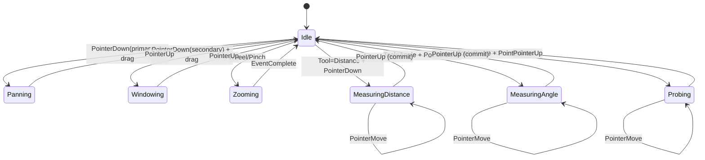

# Rendering and interaction

## Overview

Normative: Viewer behavior (viewport transforms, interaction transitions, and measurement semantics) **MUST** conform to this document to be considered stable.

This document specifies the rendering runtime and interaction model for 2D (and shared components for future volume/MPR support).

## Implemented now (RC-2026.02.12)
Status: **Partially implemented rendering stack** (As of 2026-02-21)
Reference: `docs/31-Implementation-Status.md#major-subsystems`

- Native path: `viewer-wgpu` lifecycle validation, CPU-oracle frame acceptance, deterministic GPU budget accounting, and an offscreen acquire/draw/present command path are implemented.
- Web path: `viewer-wasm` host renders CPU-oracle output via CPU/canvas by default and can activate a gated WebGPU browser draw path.
- Determinism contract: CPU pipeline output is the correctness oracle across native/WASM; GPU paths are presentation-only.

## Target architecture (deferred/planned)

- Native/WebGPU advanced texture pooling/cache topology and device-loss recovery hardening remain planned.
- WebGPU runtime fallback orchestration (WebGPU -> CPU) and gated production browser draw activation are implemented in the WASM host path.
- Volume/MPR baseline integration is active through CPU reslice APIs and web-host tri-planar validation views; advanced workstation UX remains planned.

Status source: `docs/31-Implementation-Status.md`.

### Runtime behavior matrix (RC-2026.02.12)

| Runtime path | Current state | Notes |
|---|---|---|
| Native `viewer-wgpu` draw/present | Implemented (baseline) | CPU oracle remains correctness boundary. |
| WASM CPU/canvas | Implemented | Active production rendering path in `viewer-wasm`. |
| WASM backend selection + WebGPU->CPU fallback | Implemented (baseline coordination) | Capability probe, fallback counters, and recovery hooks are wired. |
| WASM production WebGPU browser draw path | Implemented (gated) | Activation requires explicit runtime flag plus capability checks; fail-closed default remains CPU path. |

---

## 1. Viewport model

### Coordinate spaces

Requirements:

- **REQ-UI-001:** All transforms and measurements **MUST** explicitly reference one of these spaces; implicit mixing of spaces is forbidden.

Verification:

- Unit tests **MUST** exercise coordinate conversions and assert that mixed-space operations are rejected or require explicit conversion.

- **Image space**: continuous coordinates `(x_img, y_img)` where pixel centers lie at half-integers or integers per chosen convention.
- **Screen space**: pixel coordinates in the window/canvas.
- **Normalized device coordinates (NDC)**: `[-1, 1]` range used by GPU.

### Canonical image coordinate convention (normative)

Requirements:

- **REQ-UI-002:** Renderers and tools **MUST** use this convention so that pixel probes and measurements align with displayed pixels.

Verification:

- Unit tests **MUST** validate pixel-center mapping for `(i,j)` → `(i+0.5, j+0.5)` and top-left origin assumptions.

- Pixel index `(i,j)` refers to column `i` and row `j`, 0-based.
- Pixel center in continuous image space is `(i + 0.5, j + 0.5)`.
- The top-left pixel `(0,0)` is rendered at the top-left of the image when rotation = 0 and no flips are applied.

### View transform (normative)

A `Viewport2D` is defined by:

- `center_img: (f64, f64)` — image-space point mapped to the center of the screen.
- `zoom: f64` — scale factor in screen pixels per image pixel.
- `rotation_quadrants: i32` — rotation in multiples of 90° (0,1,2,3).
- `flip_x: bool`, `flip_y: bool` — optional mirroring.
- `window_level: WindowLevelState` — selected VOI parameters (or auto).

Requirements:

- **REQ-UI-003:** The viewport transform **MUST** be deterministic and purely derived from interaction state + config.
- **REQ-UI-004:** Rotation **MUST** be restricted to multiples of 90° in the core viewer to avoid resampling ambiguity; arbitrary rotation is permitted only if a deterministic resampler is specified and validated.

Verification:

- Unit tests **MUST** verify that the viewport transform is identical for repeated runs of the same interaction sequence and config.
- Integration tests **SHOULD** verify that non-90° rotations are rejected unless a resampler feature is explicitly enabled.

---

## 2. Interaction state machine

### Inputs

Requirements:

- **REQ-UI-010:** The event processing layer **MUST** treat the input stream as ordered and process it deterministically to produce identical state transitions for identical events.

Verification:

- Unit tests **MUST** replay identical event streams and assert identical interaction states and viewport configs.

- Pointer events: down/move/up (mouse/touch)
- Wheel/scroll events
- Keyboard modifiers

### State machine (normative)

Requirements:

- **REQ-UI-011:** Tool mode selection **MUST** be explicit (no hidden mode switching).
- **REQ-UI-012:** The same input sequence **MUST** produce the same viewport state transitions and resulting config changes.

Verification:

- Unit tests **MUST** cover canonical input sequences for each tool state and assert deterministic state transitions.

---

## 3. Measurement tools

### Measurement modes and calibration gating (normative)

DiCCY distinguishes between **pixel-domain measurements** and **physical-unit measurements** (quantitative mode) within the workstation profile.

Requirements:

- **REQ-MEAS-001:** Workstation builds **MUST** expose both calibrated physical-unit outputs and pixel-domain outputs, with explicit provenance and calibration state.
- **REQ-MEAS-010:** Physical-unit measurements (mm) **MUST** be available in the workstation profile whenever required calibration tags are valid; pixel-domain fallback **MUST** be used when calibration is unavailable.
- **REQ-MEAS-020:** When physical-unit mode is enabled, the implementation **MUST** fail closed (no mm output) if required calibration tags are missing, invalid, or out-of-envelope.
- **REQ-MEAS-030:** Physical-unit outputs **MUST** include provenance metadata (which DICOM tags were used) and an explicit `calibrated: bool` flag.
- **REQ-MEAS-040:** The framework **MUST NOT** claim measurement accuracy. Instead it **MUST** expose an integrator-settable `MeasurementUncertainty` interface for downstream validation contexts.

Implementation baseline:

- `viewer-core` exposes deterministic measurement controls through:
  - explicit measurement mode selection (`pixel` vs `physical`),
  - Pixel Spacing calibration injection with provenance (`0028,0030`),
  - integrator-set uncertainty metadata attached to measurement records.

Verification:

- Unit tests **MUST** assert calibrated output behavior when calibration tags are valid and fallback behavior when invalid.
- Corpus tests **MUST** include cases with missing/invalid Pixel Spacing and assert pixel-domain fallback plus provenance markers.

### Distance (2D)

Inputs:
- two points in image space, `p0`, `p1`.

Calibration:
- Pixel Spacing (0028,0030) provides spacing `(sx, sy)` in mm.

Computation (normative):
- If Pixel Spacing is valid:
  - `dx_mm = (p1.x - p0.x) * sx`
  - `dy_mm = (p1.y - p0.y) * sy`
  - `dist_mm = sqrt(dx_mm^2 + dy_mm^2)`
- If Pixel Spacing missing/invalid:
  - measurement **MUST** be marked “uncalibrated” and expressed in pixels.

Requirements:

- **REQ-MEAS-050:** Distance tools **MUST** treat missing or invalid Pixel Spacing as uncalibrated and **MUST** emit pixel-domain output only.

Verification:

- Unit tests **MUST** cover missing/invalid Pixel Spacing and assert uncalibrated pixel-domain output.

### Angle (2D)

Requirements:

- **REQ-MEAS-060:** If either segment length is zero, the tool **MUST** fail closed with an invalid-measurement state rather than producing NaN.

Inputs:
- three points `a` (vertex), `b`, `c`.
- In the baseline interaction model, angle capture is two-stage:
  - first drag/up captures arm `b`,
  - second drag/up captures arm `c` and commits the angle.

Computation (normative):
- Compute `cos_theta = dot((b-a),(c-a)) / (|b-a|*|c-a|)`.
- Clamp `cos_theta` to `[-1.0, 1.0]` to avoid NaN from rounding overshoot.
- Compute `theta = acos(cos_theta)`.
- Output in degrees.
- If any intermediate is non-finite, the tool **MUST** fail closed.

Requirements:

- **REQ-MEAS-061:** Angle computation **MUST** clamp `cos_theta` to `[-1.0, 1.0]` and **MUST** fail closed if any intermediate is non-finite.

Verification:

- Unit tests **MUST** cover zero-length segments, rounding overshoot, and non-finite intermediates.

### Requirements (normative)

- **REQ-MEAS-070:** Tools **MUST** explicitly record whether measurement is calibrated and which tag provided calibration.
- **REQ-MEAS-071:** Tools **MUST NOT** silently invent spacing.
- **REQ-MEAS-080:** Measurement overlays **MUST** be deterministic and expressed in a stable precision (e.g., fixed decimals).

Verification:

- Unit tests **MUST** assert calibrated/uncalibrated flags and tag provenance for measurement outputs.
- Unit tests **MUST** verify overlay formatting determinism for fixed inputs.

---

## 4. Annotation policy

- Viewer annotations are persisted workstation state with explicit provenance and audit context.
- **REQ-UI-020:** The framework **MUST** support deterministic export/persistence workflows for annotations, overlays, and reporting artifacts with explicit audit attribution and versioning.
- Batch preview/export runtime controls (including `dicom-visualizer`) emit deterministic `manifest.csv` rows and per-item fail-closed status capture, and write a deterministic `manifest.integrity.json` sidecar with `sha256` hashes, record counts, and non-secret build/envelope metadata (`application_version`, `build_id`, `envelope_version`) aligned with `REQ-HI-279`, `REQ-HI-312`, and `REQ-HI-315`.
- Optional gallery output is explicitly toggle-gated (`--no-index`) and uses deterministic escaping for HTML/CSV artifact fields (`REQ-HI-314`, `REQ-HI-359`), including HTML entity escaping for attribute/text contexts and CSV protections for quote/comma/newline and formula-like prefixes.
- If a DICOM overlay plane exists:
  - it may be rendered (per `docs/05`) and persisted through explicit workflow actions.

Verification:

- Integration tests **MUST** confirm that persistence/export workflows produce deterministic outputs and preserve audit provenance.
- Integration tests **MUST** verify deterministic manifest ordering, escaping behavior, per-item failure isolation, and integrity sidecar hash reproducibility for batch preview/export paths.

### Presentation state and derived-object packs (optional)

When optional presentation/derived-object packs are enabled (GSPS, SEG, SR, RT), the renderer and UI **MUST** apply deterministic ordering and strict gating rules.

Requirements:

- **REQ-UI-060 / REQ-GSPS-300:** GSPS application **MUST** be deterministic and applied in display space after the CPU pixel pipeline output and before user annotations.
- **REQ-UI-061 / REQ-GSPS-301:** Shutters **MUST** be applied deterministically in display space; workstation scope supports RECTANGULAR, CIRCULAR, and polygonal shutters, and pixels outside the shutter **MUST** be set to a documented background value (Shutter Presentation Value if present, otherwise 0).
- **REQ-UI-062 / REQ-GSPS-302:** Overlay layering **MUST** be deterministic with explicit precedence: CPU pixel pipeline output (including DICOM overlays) → GSPS shutters → GSPS graphics → segmentation overlays → user annotations.
- **REQ-UI-063:** Segmentation overlays **MUST** use stable color assignment and alpha rules; overlapping segments **MUST** use deterministic tie-breaking. Segmentation overlays **MUST** require Frame of Reference UID and referenced SOP Instance UID alignment and **MUST** fail closed if deterministic alignment/resampling policies cannot be satisfied.
- **REQ-UI-064 / REQ-GSPS-303:** GSPS graphic annotations **MUST** support workstation baseline object types (`POINT`, `POLYLINE`, `INTERPOLATED`, `CIRCLE`, `ELLIPSE`) rendered in display space using deterministic coordinate mapping, rounding, clipping, and draw ordering. The current deterministic scope renders `INTERPOLATED` as piecewise-linear control-point segments.
- **REQ-UI-065 / REQ-GSPS-304:** Unsupported GSPS graphic types, invalid topology, or non-finite coordinates **MUST** fail closed and return a structured error.

Requirements (SR-linked measurements):

- **REQ-MEAS-081:** SR-derived measurements **MUST** include provenance metadata (referenced SOP Instance UID, concept code, and units).
- **REQ-MEAS-082:** SR-derived measurements **MUST** only render when the referenced image/frame is active; otherwise they **MUST** be hidden or marked unavailable. The initial scope supports `NUM` content items with measured value sequences and deterministic read-only extraction of `TEXT` and `CODE` content observations.
- **REQ-MEAS-083:** Persisted measurements **MUST** preserve stable IDs and calibration state; missing calibration **MUST** render as pixel-domain only.

Verification:

- Integration tests **MUST** validate GSPS/shutter/graphic ordering against a golden render (REQ-UI-060..REQ-UI-064, REQ-GSPS-300..REQ-GSPS-303).
- Unit tests **MUST** validate deterministic segmentation overlay ordering and color assignment (REQ-UI-063).
- Unit tests **MUST** validate SR provenance fields and gating behavior (REQ-MEAS-081..REQ-MEAS-083).

---

## 5. GPU resource lifecycle

### Device and surface (normative)

- `viewer-wgpu` **MUST**:
  - accept a probed/injected `wgpu::Device`,
  - enforce explicit surface configuration before draw submission,
  - perform deterministic frame-target acquire -> render-pass encode -> queue submit -> present sequencing,
  - fail closed when render is attempted before lifecycle prerequisites are met.
- Runtime hosts (`viewer-wasm` / native app entrypoints) are responsible for `wgpu::Instance`, adapter/device acquisition, and platform surface creation.
- On resize:
  - surface configuration **MUST** be updated,
  - dependent framebuffers **MUST** be recreated deterministically.

### Texture formats and fallbacks

The renderer **MUST** support at least one grayscale path and one color path.

Preferred:
- Grayscale: `R8Unorm` (texture) + shader expands to RGB for display.
- Color: `Rgba8UnormSrgb`.

Fallback:
- If `R8Unorm` is unsupported on a target/backend:
  - the pipeline **MUST** upload grayscale as `Rgba8UnormSrgb` (replicated channels) or as a supported single-channel format.

Verification method:
- Runtime capability probe selects formats.
- A renderer conformance test **MUST** log chosen formats and validate that a golden frame renders without error.

### Resource budgeting (normative)

- **REQ-UI-040:** The renderer **MUST** enforce a VRAM budget for cached textures and **MUST** default to `max_gpu_texture_bytes` from `docs/09` unless explicitly overridden in configuration.
- **REQ-UI-041:** Eviction **MUST** be deterministic (e.g., LRU with stable tie-breaking by FrameKey).
- **REQ-UI-042:** The renderer **MUST** avoid unbounded per-frame allocations during interactive operations.

Verification:

- Unit tests **MUST** verify deterministic eviction order under stable access patterns.
- Integration tests **SHOULD** exercise GPU budget enforcement with a synthetic workload and assert `LimitExceeded(max_gpu_texture_bytes)` behavior.
- Performance tests **SHOULD** assert no unbounded per-frame allocations during interactive operations.

---

## 6. Color management assumptions

Assumptions:
- Display output is treated as sRGB.
- No ICC profile handling is implemented in the core.

Requirements:
- **REQ-UI-050:** The renderer **MUST** treat `Rgba8UnormSrgb` textures as sRGB and avoid double-gamma.
- **REQ-UI-051:** Grayscale values produced by the pixel pipeline (0..255) are treated as display-ready and mapped to sRGB without additional tone curves unless explicitly enabled.

Verification:
- Include a synthetic grayscale ramp test and ensure monotonic output in rendered capture (where capture is available) or via shader unit tests.

---

## 7. Verification requirements

- Unit tests **MUST** cover:
  - viewport transform math (round-trip checks),
  - interaction state transitions for canonical input sequences,
  - measurement computations and calibration flags.
- Integration tests **SHOULD** include:
  - headless renderer validation where feasible,
  - golden-corpus pixel hash validation at the CPU boundary (always required).
