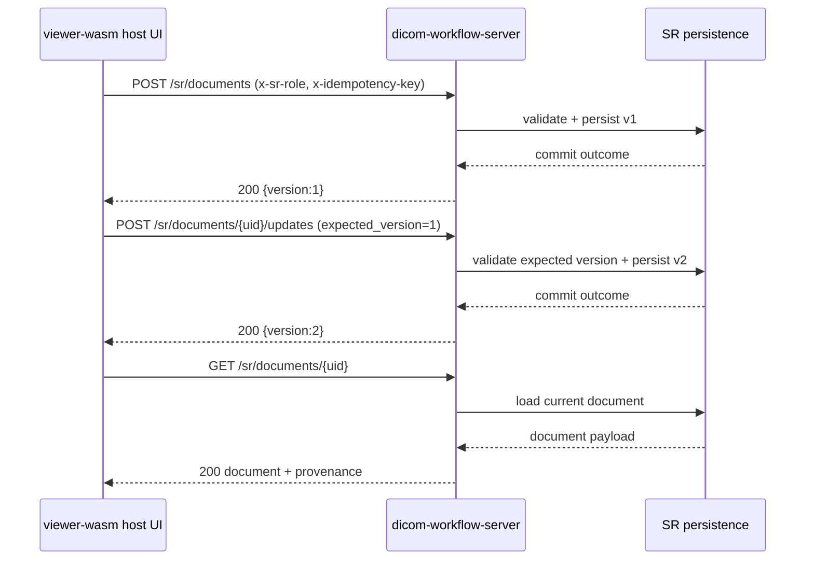
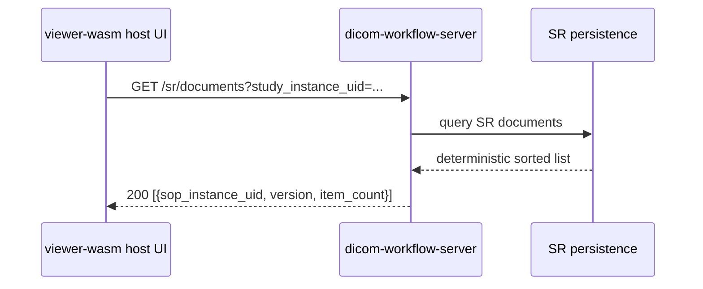

# SR Workflow Architecture

Status: **Implemented baseline service workflow** (As of 2026-02-22)
Reference: `docs/31-Implementation-Status.md#major-subsystems`

## 1. Scope

This document defines the SR workflow path from baseline API support (`pack-sr`) to service-layer commit workflows (`dicom-workflow-server`) and the minimal web-host workflow prototype.

Baseline flow:
1. Capture measurement/observation payload.
2. Create SR document through service endpoint.
3. Update SR document through versioned endpoint.
4. Retrieve authored SR document for review.

## 2. Layered architecture

| Layer | Responsibility | Current baseline |
|---|---|---|
| API layer (`pack-sr`) | Deterministic SR authoring/update primitives and reference validation | Implemented |
| Service layer (`dicom-workflow-server`) | Auth-gated create/update/retrieve lifecycle, persistence, idempotency, typed conflicts | Implemented |
| UI workflow layer (`viewer-wasm/web`) | Minimal author/review/commit prototype for service endpoints | Implemented (prototype) |

## 3. Endpoint contract

| Method | Route | Operation | Auth gate | Idempotency |
|---|---|---|---|---|
| `POST` | `/sr/documents` | Create SR document | Requires write principal + writer role | Required (`x-idempotency-key`) |
| `POST` | `/sr/documents/{sop_instance_uid}/updates` | Update SR document | Requires write principal + writer role | Required (`x-idempotency-key`) |
| `GET` | `/sr/documents/{sop_instance_uid}` | Retrieve SR document | Read access | Not required |
| `POST` | `/sr/documents/{sop_instance_uid}/review` | Review SR document | Requires write principal + writer role | Required (`x-idempotency-key`) |
| `POST` | `/sr/documents/{sop_instance_uid}/finalize` | Finalize SR document | Requires write principal + writer role | Required (`x-idempotency-key`) |
| `POST` | `/sr/documents/{sop_instance_uid}/commit` | Commit SR document | Requires write principal + writer role | Required (`x-idempotency-key`) |
| `POST` | `/sr/documents/{sop_instance_uid}/cancel` | Cancel SR document | Requires write principal + writer role | Required (`x-idempotency-key`) |
| `GET` | `/sr/documents/{sop_instance_uid}/history` | Read SR lifecycle history | Read access | Not required |
| `GET` | `/sr/documents` | List SR documents | Read access | Not required |

Fail-closed behavior:
- Missing/invalid write role is rejected.
- Missing idempotency key is rejected for create/update/transition.
- Referenced SOP validation is enforced for authored items.

### SR lifecycle and immutable transitions

The SR lifecycle state machine is explicit:

- `DRAFT -> REVIEWED`
- `DRAFT -> CANCELLED`
- `REVIEWED -> FINALIZED`
- `REVIEWED -> CANCELLED`
- `FINALIZED -> COMMITTED`
- `FINALIZED -> CANCELLED`
- `COMMITTED -> COMMITTED` (replay/idempotent success)
- `CANCELLED -> CANCELLED` (replay/idempotency success)

SR transition endpoints:
- `POST` `/sr/documents/{sop_instance_uid}/review`
- `POST` `/sr/documents/{sop_instance_uid}/finalize`
- `POST` `/sr/documents/{sop_instance_uid}/commit`
- `POST` `/sr/documents/{sop_instance_uid}/cancel`

History and immutability notes:
- Every successful transition appends a durable history entry with `action`, `status`, and `version`.
- `GET` `/sr/documents/{sop_instance_uid}/history` returns the immutable transition log for audit review.
- Invalid transitions return `DVF.WORKFLOW.SR.INVALID_TRANSITION`.

### Frontend-to-service sequence (host workflow)

### Frontend list/search sequence

## 4. Idempotency and conflicts

Service behavior:
- Create/update requests are keyed by operation + target SOP UID + idempotency key.
- Replay with identical payload returns deterministic duplicate outcome.
- Replay with different payload fails with conflict.
- Update operations enforce explicit `expected_version`; mismatches return typed version-conflict errors.

## 5. Persistence and recovery

Persistence artifacts:
- SR snapshot: `DICOM_WORKFLOW_SR_STATE_PATH` (default `./state/workflow/sr.snapshot`)
- SR audit stream: `DICOM_WORKFLOW_SR_AUDIT_PATH` (default `./state/workflow/sr.audit.log`)

Recovery:
- SR documents are reloaded on startup from snapshot.
- Recovery diagnostics include restored SR document count.

## 6. Permissions, provenance, rollback

Permissions:
- Write operations require explicit writer role and principal identity.
- Authorization defaults remain fail-closed when runtime auth/transport policy is insecure or invalid.

Provenance:
- Immutable SR provenance (`study`, `series`, `sop`) is preserved by update path.
- Observer override is explicit and version-tracked.

Rollback semantics:
- SR snapshot rotation follows workflow snapshot retention policy.
- Failed writes do not mutate persisted SR state.
- Replay-safe idempotency allows retry without duplicate mutation.

## 7. Audit privacy constraints

SR audit stream stores only non-PHI operational metadata:
- operation name,
- outcome,
- hashed SOP UID,
- hashed principal,
- hashed idempotency key,
- resulting version.

Raw identifiers and authored observation text are not emitted in audit lines.

## 8. Verification

- `cargo test -p dicom-workflow-server` validates:
  - create/update/retrieve lifecycle,
  - idempotency replay and conflict rejection,
  - typed version-conflict/auth-denied errors,
  - non-PHI SR audit payload constraints,
  - restart recovery with SR persistence.
