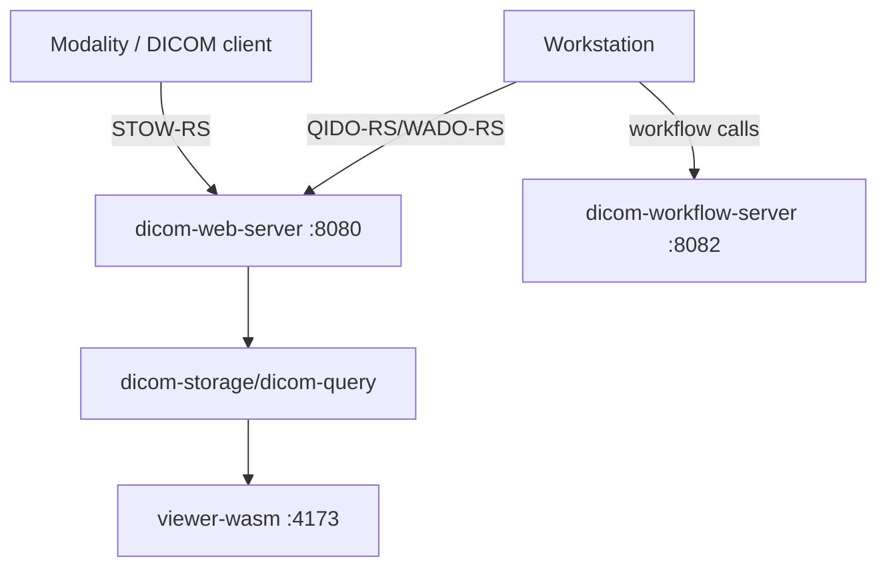
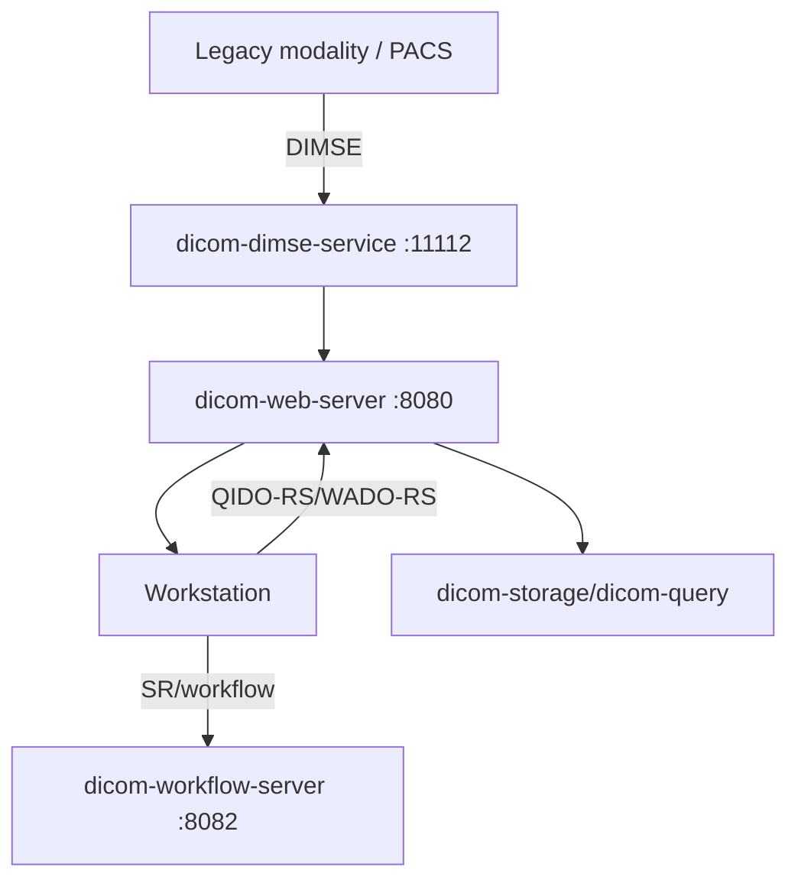

# Reference Deployment Topology

Status: **Baseline reference topology** (As of 2026-02-22)

## 1. Purpose

This document defines the reference deployment connecting web host, DICOMweb, workflow services, and optional legacy DIMSE integration points.

## 2. Components

| Layer | Component | Role |
|---|---|---|
| Client | `viewer-wasm` web host | Interactive viewing, MPR controls, SR workflow prototype |
| API | `dicom-web-server` | QIDO/WADO/STOW HTTP interface |
| Workflow | `dicom-workflow-server` | MWL/MPPS/SR workflow endpoints |
| Data | `dicom-storage` + `dicom-query` | Deterministic persistence and indexed query |
| DIMSE | `dicom-dimse-service` | Optional runnable runtime; included only when deploying `backend-services-with-dimse.<RELEASE_ID>.tar.gz` |

## 3. Logical flow

1. DICOMweb ingest/query/retrieve path (default):
   - Workstation and integrations use `dicom-web-server` for STOW/QIDO/WADO.
   - Storage validates/fails closed and persists datasets.
2. Workflow path:
   - Worklist/MPPS/SR lifecycle handled by workflow server.
   - SR create/update/retrieve workflow endpoints provide reporting path.
3. Visualization path:
   - Web host renders CPU-oracle outputs, tri-planar MPR, and SR prototype workflow.
4. Optional DIMSE path:
   - A DIMSE transport service may be included where legacy modality/PACS integration requires it.
   - This is a profile-gated runtime mode; it requires `backend-services-with-dimse.<RELEASE_ID>.tar.gz` and explicit startup commands in `docs/33-Productization-Profiles-and-Playbooks.md`.

## 3a. Deployment glossary

- **DICOMweb path:** STOW/QIDO/WADO over HTTP(S) handled by `dicom-web-server`.
- **Workflow path:** MWL/MPPS/SR services, state persistence, and status transitions handled by `dicom-workflow-server`.
- **Storage/query boundary:** `dicom-storage` provides canonical ingested dataset persistence and dataset lookup; `dicom-query` evaluates DIMSE/DICOMweb query constraints.
- **DIMSE boundary:** `dicom-dimse-service` is a runnable service and is optional; when enabled, it is delivered by `backend-services-with-dimse.<RELEASE_ID>.tar.gz` and acts as an explicit integration runtime in front of, or alongside, `dicom-web-server` and `dicom-workflow-server`.
- **Viewer boundary:** `viewer-wasm` and `viewer-wgpu` consume HTTP/Web artifacts from web/workflow services and should not depend on raw DIMSE transport state.

## 4. Runtime endpoints (default local)

| Service | Default bind |
|---|---|
| `dicom-web-server` | `127.0.0.1:8080` |
| `dicom-workflow-server` | `127.0.0.1:8082` |
| `viewer-wasm` static host | `127.0.0.1:4173` (via local frontend script) |

Override example:

```bash
./tools/run_viewer_wasm_frontend.sh --port 5180
```

Then open `http://127.0.0.1:5180`.

Endpoint contract alignment:
- `dicom-web-server` serves QIDO/WADO/STOW routes at `127.0.0.1:8080` as specified in `docs/12-API-Surface-and-Crate-Boundaries.md`.
- `dicom-workflow-server` serves MWL/MPPS/SR routes at `127.0.0.1:8082` as specified in `docs/12-API-Surface-and-Crate-Boundaries.md`.
- `viewer-wasm` at `127.0.0.1:4173` targets those backends unless explicit overrides are provided.

## 4a. Request-path diagrams

### DICOMweb-only default mode



### DIMSE-integrated legacy mode



## 3b. Workstation startup preconditions and artifact expectations

### Script-hosted default posture

- `workstation` launch is currently script-hosted via `./tools/run_viewer_wasm_frontend.sh`; there is no guaranteed standalone `viewer-*` binary in the current `workstation` archive contract.
- Before front-end launch, confirm service endpoints and profile readiness:
  - `dicom-web-server` and `dicom-workflow-server` are healthy and reachable.
  - `capability.manifest.json` in the relevant profile artifact reflects active services.
  - Frontend host port and backend overrides are set before first render.
- Archive expectation for `workstation` in this repository state:
  - `dist/profiles/workstation.<RELEASE_ID>.tar.gz` includes `capability.manifest.json` and profile metadata.
  - `bin/<binary>` viewer entries are optional and currently not required by default.

### Pre-start checks

- Confirm runtime mode claims:
  - `docs/12-API-Surface-and-Crate-Boundaries.md`
  - `docs/33-Productization-Profiles-and-Playbooks.md`
- Validate claim checks before deployment:
  - `./tools/run_viewer_wasm_frontend.sh --help`
  - `python3 tools/runtime_env_contract.py --repo-root . --check-docs`

## 5. Runtime constraints

- Transport and auth default fail-closed unless explicitly configured.
- Interoperability ingress for workflow is exposed by `dicom-workflow-server` through `/interop/hl7` and `/interop/subscriptions`.
- All service state artifacts are path-backed and rotation-bounded.
- SR workflow audit output must remain non-PHI (hashed operational metadata only).
- Out-of-envelope inputs must fail closed across ingestion paths.

## 6. Reproducible local bring-up

1. Start DICOMweb server (`cargo run -p dicom-web-server`).
2. Start workflow server (`cargo run -p dicom-workflow-server`).
3. Start web host frontend (`./tools/run_viewer_wasm_frontend.sh --port 4173`).
4. Run `./tools/local_demo_end_to_end.sh` to validate ingest/query/retrieve/MPR/SR baseline paths.
5. If running DIMSE mode, start `cargo run -p dicom-dimse-service -- --bind 127.0.0.1:11112` and verify route-to-storage/workflow bindings and health checks (`/healthz`, `/readyz` when configured).
6. Run `python3 tools/runtime_env_contract.py --repo-root . --check-docs` before finalizing deployment mode claims.

## 7. Scope boundary and script cross-links

- This topology is DICOMweb-first by default; DIMSE remains optional and is only included when using `backend-services-with-dimse.<RELEASE_ID>.tar.gz` (see `docs/33-Productization-Profiles-and-Playbooks.md`).
- Packaged profile claim references:
  - `./tools/package_profiles.sh`
  - `./tools/run_viewer_wasm_frontend.sh`
  - `./tools/local_demo_end_to_end.sh`
- Any topology claim that implies a runnable service must have a corresponding startup script or documented service-entrypoint in `docs/12-API-Surface-and-Crate-Boundaries.md`.

## Source-of-truth footer

- Runtime topology claims are sourced from `docs/12-API-Surface-and-Crate-Boundaries.md` and `docs/14-Release-and-Versioning.md`.
- Deployment scripts are the only authoritative source for entrypoint command forms (`tools/*.sh`).
